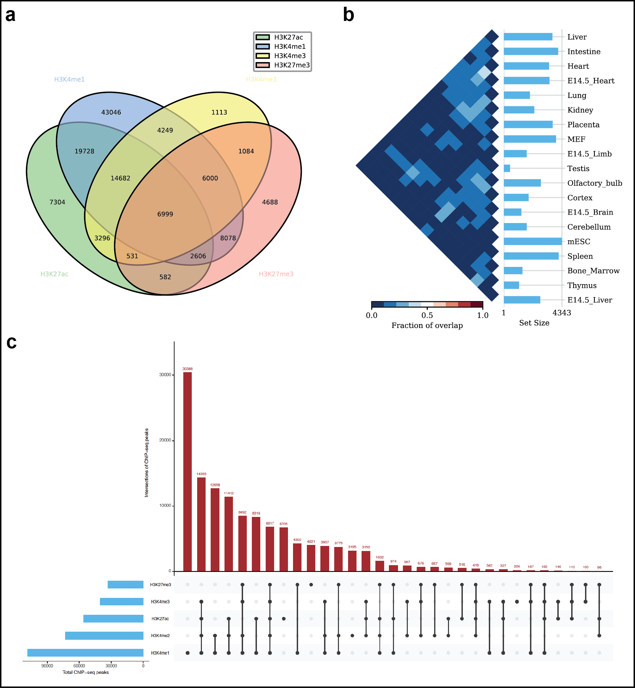

Introduction
============
Intervene is a tool for intersection and visualization of multiple genomic region and gene sets.

[Documentation](http://intervene.readthedocs.org)

Installation
============

Intervene requires the following Python modules and R packages:

	* Python (=> 2.7 ): https://www.python.org/
	* BedTools (Latest version): https://github.com/arq5x/bedtools2
	* pybedtools (>= 0.7.9): https://daler.github.io/pybedtools/
	* Pandas (>= 0.16.0): http://pandas.pydata.org/
	* R (>= 3.0): https://www.r-project.org/
	* R packages including UpSetR, corrplot

Install BEDTools
-----------------
We are using pybedtools, which is Python wraper of BEDTools. So, BEDTools is should be installed before using Intervene.It's recomended to have a latest version, but if you have an older version already install. Please read the instructions at https://github.com/arq5x/bedtools2 to install BEDTolls, and make sure the bedtools is on your path and you are able to call it from any directory.

Install required Python modules
-------------------------------
If you already have a working installation of Python, the easiest way to install required Python modules is by using ``pip``. If you're setting up Python for the first time, we recommend to install it using Anaconda Python distribution http://continuum.io/downloads. These come with several helpful scientific and data processing libraries. These are available for platforms including Windows, Mac OSX and Linux.

**Install pybedtools**

Install it from PyPi

.. code-block:: bash

	pip install pybedtools

or using conda

.. code-block:: bash

	conda install -c bioconda pybedtools

Read more details about ''pybedtools'' installation: https://daler.github.io/pybedtools/main.html

**Install Pandas**

Install it from PyPi

.. code-block:: bash

	pip install pandas

Or install with conda

.. code-block:: bash

	conda install pandas

**Install argparser**

.. code-block:: bash
	
	pip install argparser

Install required R packages
---------------------------

Intervene rquires two R packages, ``UpSetR`` https://cran.r-project.org/package=UpSetR and ``corrplot`` https://cran.r-project.org/package=corrplot for visualization.

.. code-block:: R

    install.packages(c("UpSetR", "corrplot"))

Install Intervene
=================
You can install a stable version of Intervene by using ``pip`` from PyPi or a development version by using ``git`` from GitHub.

Install using `pip`
-------------------
You can install InterVene either from PyPi using pip or install it from the source. Please make sure you have already installed the above mentioned python libraries required to run InterVene.

Install from PyPi::

	pip install intervene

Install development version from `GitHub`
-----------------------------------------

If you have `git` installed, use this:

.. code-block:: bash

    git clone https://github.com/asntech/intervene.git
    cd intervene
    python setup.py install

How to use Intervene
====================
Once you have installed Intervene, you can type:

.. code-block:: bash

	intervene --help

	usage: intervene <subcommand> [options]
	    
	positional arguments <subcommand>:
	  {venn,upset,pairwise}
	                        List of subcommands
	    venn                Venn diagram of intersection of genomic regions or list sets (upto 6-way).
	    upset               UpSet diagram of intersection of genomic regions or list sets.
	    pairwise            Pairwise intersection and heatmap of N genomic region sets in <BED/GTF/GFF> format.

	optional arguments:
	  -h, --help            show this help message and exit
	  -v, --version         show program's version number and exit

to see the help for the three subcommands ``pairwise``, ``venn`` and ``upset`` type::
	
	intervene pairwise --help

	intervene venn --help

	intervene upset --help

Run Intervene on test data
--------------------------

To run Intervene using example data use the following command::

	intervene pairwise --test

	intervene venn --test

	intervene upset --test

This will save the results in the current working directory with a folder named ``Intervene_test``. If you wish to save the results in a specific folder, you can type::

	intervene upset --test --output ~/path/to/your/folder/file_name.pdf

Support
========
If you have questions, or found any bug in the program, please write to us at ``aziz.khan[at]ncmm.uio.no``

Cite Us
=========
If you use Intervene please cite us: ``Khan A. and Mathelier A., Intervene: a tool for intersection and visualization of multiple genomic region sets``
