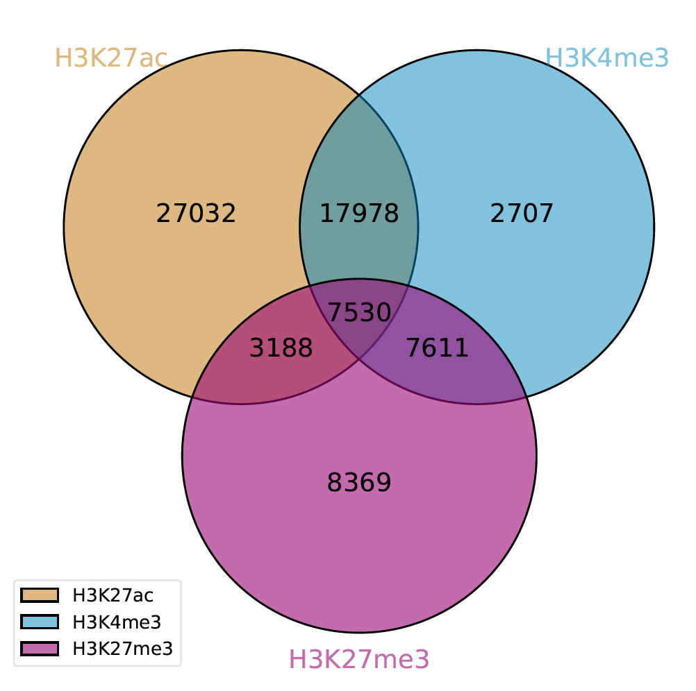
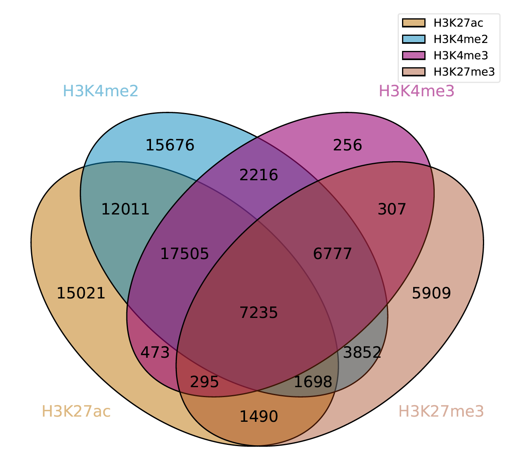
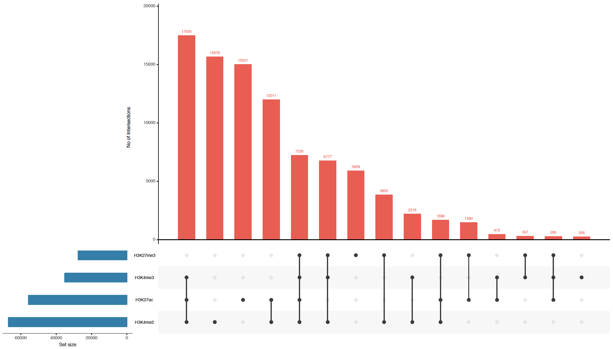
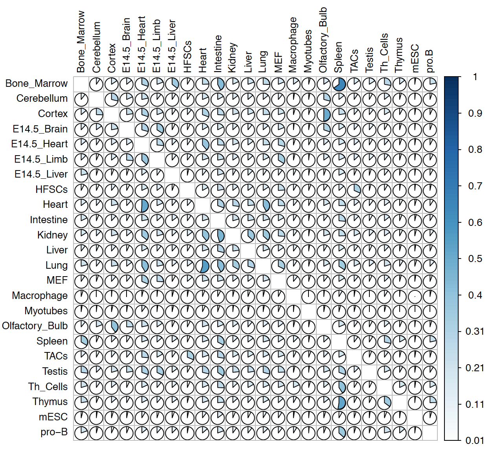
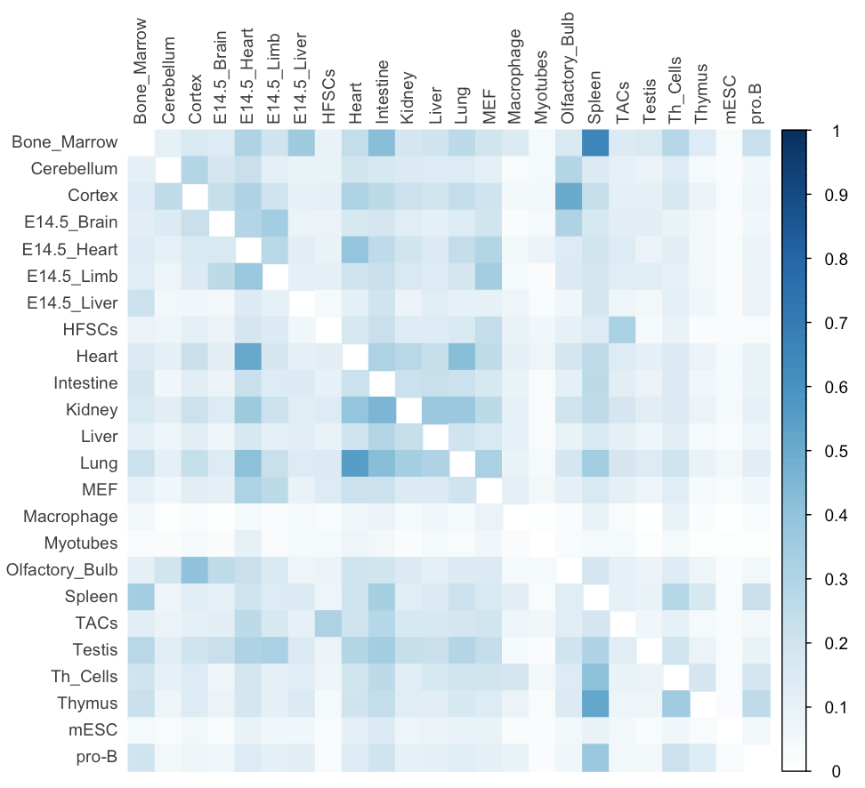
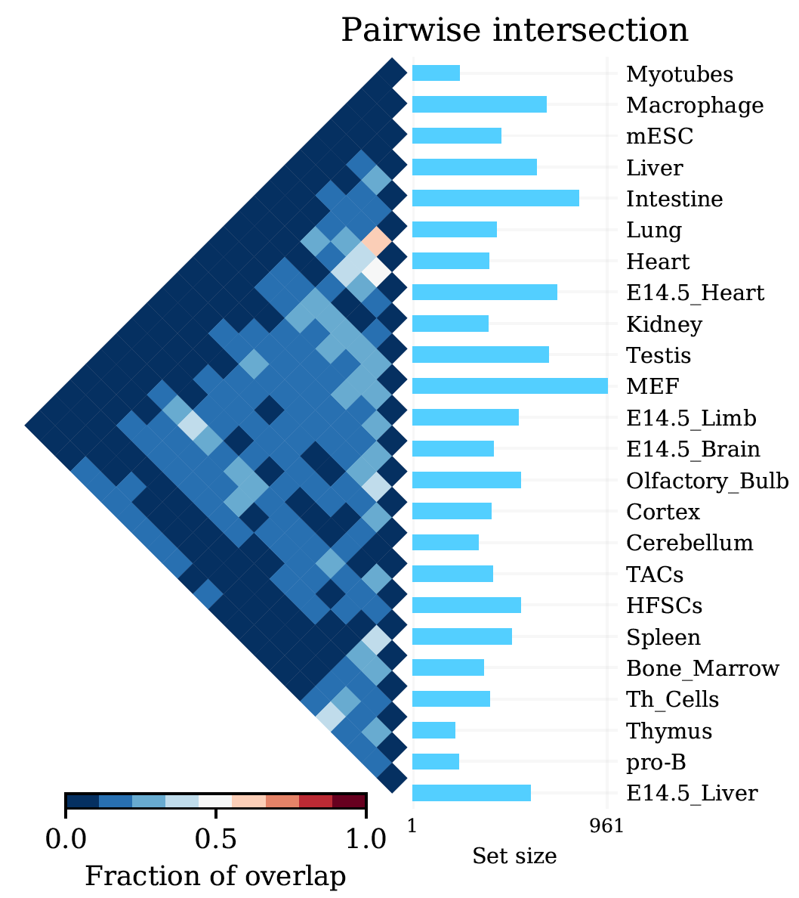

===============
Example gallery
===============

Here we provide some examples of how Intervene can be used to generate different types of set intersection plots.

Venn module examples
====================
In this example, a 3-way Venn diagram of ChIP-seq peaks of histone modifications (H3K27ac, H3Kme3 and H3K27me3) in hESC from ENCODE data (Dunham et al., 2012).

.. code-block:: bash

    intervene venn -i ~/ENCODE/data/H3K27ac.bed ~/ENCODE/data/H3Kme3.bed ~/ENCODE/data/H3K27me3.bed --filenames

By adding one more BED file to ``-i`` argument, Intervene will generate a 4-way Venn diagram of overlap of ChIP-seq peaks.

.. code-block:: bash

    intervene venn -i ~/ENCODE/data/H3K27ac.bed ~/ENCODE/data/H3Kme3.bed ~/ENCODE/data/H3K27me3.bed  ~/ENCODE/data/H3Kme2.bed --filenames

Read more about the ``venn`` diagrams module here:

.. code-block:: bash

    intervene venn --help

UpSet module examples
=====================
In this example, a UpSet plot of ChIP-seq peaks of four histone modifications (H3K27ac, H3Kme3 H3Kme2, and H3K27me3) in hESC from ENCODE data (Dunham et al., 2012).

.. code-block:: bash

    intervene upset -i ~/ENCODE/data/H3K27ac.bed ~/ENCODE/data/H3Kme3.bed ~/ENCODE/data/H3K27me3.bed ~/ENCODE/data/H3Kme2.bed --filenames

Read more about the ``upset`` module:

.. code-block:: bash

    intervene upset --help

Pairwise module examples
========================
In this example, we performed a pairwise intersections of super-enhancers in 24 mouse cell and tissue types from dbSUPER (Khan and Zhang, 2016) and showed the fraction of overlap in heatmap. 

.. code-block:: bash

    intervene pairwise -i ~/dbSUPER/mm9/*.bed --filenames --compute frac --htype pie

By setting the ``--htype`` to ``color`` will produce this plot.

.. code-block:: bash

    intervene pairwise -i ~/dbSUPER/mm9/*.bed --filenames --compute frac --htype color

By setting the ``--htype`` to ``tribar`` will produce a triangular heatmap and with a bar-plot of set sizes.

.. code-block:: bash

    intervene pairwise -i ~/dbSUPER/mm9/*.bed --filenames --compute frac --htype tribar

.. note:: Please make sure  that the ``tribar`` will only show lower triangle of the matrix as heatmap and diagoals are set to zero. It recommended to use this if ``--compute is set to ``jaccard``, ``fisher`` or ``reldist``.

Read more about the ``pairwise`` module here:

.. code-block:: bash

    intervene pairwise --help
 
