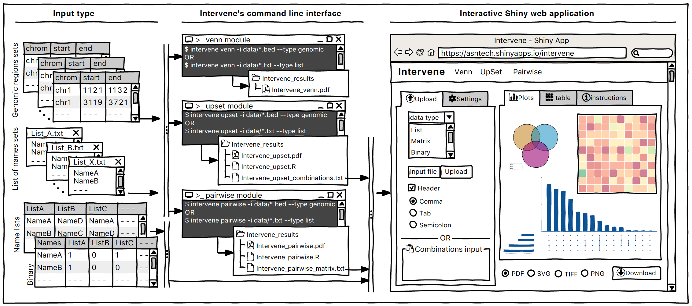

=======================
Intervene Documentation
=======================

Welcome to Intervene - a tool for intersection and visualization of multiple genomic region sets

.. image:: https://travis-ci.org/asntech/intervene.svg?branch=master
    :target: https://travis-ci.org/asntech/intervene

.. image:: https://img.shields.io/pypi/pyversions/intervene.svg
    :target: https://www.python.org

.. image:: https://img.shields.io/pypi/v/intervene.svg
    :target: https://pypi.python.org/pypi/intervene

.. image:: https://anaconda.org/bioconda/intervene/badges/version.svg
  :target: https://anaconda.org/bioconda/intervene

.. image:: https://anaconda.org/bioconda/intervene/badges/downloads.svg
    :target: https://bioconda.github.io/recipes/intervene/README.html

.. image:: https://anaconda.org/bioconda/intervene/badges/installer/conda.svg
  :target: https://conda.anaconda.org/bioconda

.. image:: https://img.shields.io/github/issues/asntech/intervene.svg
  :target: https://github.com/asntech/intervene/issues

.. image:: https://img.shields.io/twitter/url/https/github.com/asntech/intervene.svg?style=social
  :target: https://twitter.com/intent/tweet?text=Intervene%20-%20a%20tool%20for%20intersection%20and%20visualization%20of%20multiple%20genomic%20region%20and%20gene%20sets%20https://github.com/asntech/intervene&url=%5Bobject%20Object%5D

.. toctree::
   :maxdepth: 2
   :caption: Table of contents

   introduction
   install
   how_to_use
   modules
   examples
   shinyapp
   support
   cite
   changelog
