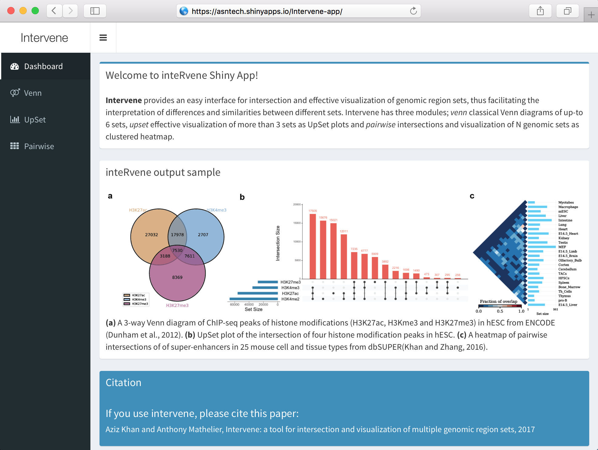

=====================
Interactive Shiny App
=====================

Introduction
============
Intervene also comes with an interactive Shiny App to further explore and filter the results in a more interactive way. Intervene command line interface also gives option to produce results as text files, which can be easily import to the Shiny App for interactive visualization and customization of plots.

Availability
============
The Intervene Shiny App is freely available at https://asntech.shinyapps.io/intervene